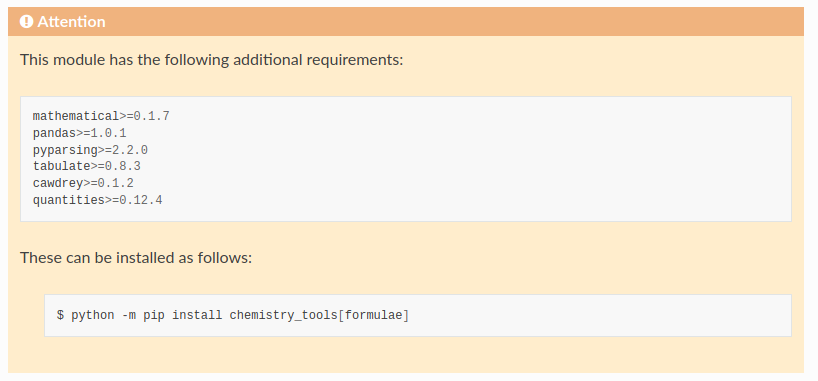

****************
extras-require
****************

.. start shields

.. image:: https://img.shields.io/travis/com/domdfcoding/extras_require/master?logo=travis
    :target: https://travis-ci.com/domdfcoding/extras_require
    :alt: Travis Build Status
.. image:: https://readthedocs.org/projects/extras_require/badge/?version=latest
    :target: https://extras_require.readthedocs.io/en/latest/?badge=latest
    :alt: Documentation Status
.. image:: https://img.shields.io/pypi/v/extras_require.svg
    :target: https://pypi.org/project/extras_require/
    :alt: PyPI
.. image:: https://img.shields.io/pypi/pyversions/extras_require.svg
    :target: https://pypi.org/project/extras_require/
    :alt: PyPI - Python Version
.. image:: https://img.shields.io/pypi/wheel/extras_require
    :target: https://pypi.org/project/extras_require/
    :alt: PyPI - Wheel
.. image:: https://img.shields.io/pypi/implementation/extras_require
    :target: https://pypi.org/project/extras_require/
    :alt: PyPI - Implementation
.. image:: https://img.shields.io/github/license/domdfcoding/extras_require
    :alt: License
    :target: https://github.com/domdfcoding/extras_require/blob/master/LICENSE
.. image:: https://img.shields.io/github/languages/top/domdfcoding/extras_require
    :alt: GitHub top language
.. image:: https://img.shields.io/github/commits-since/domdfcoding/extras_require/v0.0.2
    :target: https://github.com/domdfcoding/extras_require/pulse
    :alt: GitHub commits since tagged version
.. image:: https://img.shields.io/github/last-commit/domdfcoding/extras_require
    :target: https://github.com/domdfcoding/extras_require/commit/master
    :alt: GitHub last commit
.. image:: https://img.shields.io/maintenance/yes/2020
    :alt: Maintenance
.. image:: https://img.shields.io/codefactor/grade/github/domdfcoding/extras_require
    :target: https://www.codefactor.io/repository/github/domdfcoding/extras_require
    :alt: CodeFactor Grade

.. end shields

Display a warning at the top of module documentation that it has additional requirements.

|

Overview
--------

This extension assumes you have a repository laid out like this:

::

    /
    ├── chemistry_tools
    │   ├── __init__.py
    │   ├── formulae
    │   │   ├── __init__.py
    │   │   ├── compound.py
    │   │   ├── formula.py
    │   │   ├── parser.py
    │   │   └── requirements.txt
    │   ├── constants.py
    │   └── utils.py
    ├── doc-source
    │   ├── api
    │   │   ├── chemistry_tools.rst
    │   │   ├── elements.rst
    │   │   ├── formulae.rst
    │   │   └── pubchem.rst
    │   ├── conf.py
    │   ├── index.rst
    │   └── requirements.txt
    ├── LICENSE
    ├── README.rst
    ├── requirements.txt
    ├── setup.py
    └── tox.ini

The file ``/chemistry_tools/formulae/requirements.txt`` contains the additional requirements to run the ``formulae`` subpackage. These would be defined in ``setup.py`` like this:

.. code-block:: python

    setup(
        extras_require = {
            'formulae': [
                'mathematical>=0.1.7',
                'pandas>=1.0.1',
                'pyparsing>=2.2.0',
                'tabulate>=0.8.3',
                'cawdrey>=0.1.2',
                'quantities>=0.12.4',
                ],
        }
    )

A message can be displayed in the documentation to indicate that the subpackage has these additional requirements that must be installed.

For instance, this:

::

    .. extras-require::
        :file: formulae/requirements.txt
        :extra: formulae

will look like this:

The path given in ``:file:`` is relative to the ``package_root`` variable given in ``conf.py``, which in turn is relative to the parent directory of the sphinx documentation.

i.e, this line:

.. code-block:: python

    package_root = "chemistry_tools"

points to ``/chemistry_tools``, and therefore ``:file: formulae/requirements.txt`` points to ``/chemistry_tools/formulae/requirements.txt``.

Installation
--------------

``extras_require`` can be installed with ``pip``:

.. code-block:: bash

    $ python -m pip install extras_require

Enable ``extras_require`` by adding the following line to the ``extensions`` variable in ``conf.py``:

.. code-block:: python

    "sphinxcontrib.extras_require",

For more information see https://www.sphinx-doc.org/en/master/usage/extensions/index.html#third-party-extensions .

Future Enhancements
---------------------

* Allow use of different "scopes", e.g. ``package``, ``module``, ``class``, ``function``, depending on what the additional requirements are for.
* Support different methods of defining the requirements, e.g. ``setup.cfg``, ``setup.py``, ``__pkginfo__.py``, ``pyproject.toml``, or typing as entries in the directive itself.

Links
-----

- Source: https://github.com/domdfcoding/extras-require
- Bugs: https://github.com/domdfcoding/extras-require/issues