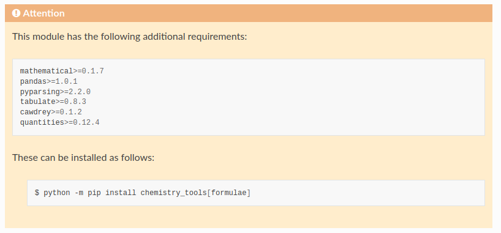

================
extras_require
================

.. start short_desc

**Display a warning at the top of module documentation that it has additional requirements.**

.. end short_desc

.. start shields

.. list-table::
	:stub-columns: 1
	:widths: 10 90

	* - Docs
	  - |docs| |docs_check|
	* - Tests
	  - |travis| |actions_windows| |actions_macos| |coveralls| |codefactor|
	* - PyPI
	  - |pypi-version| |supported-versions| |supported-implementations| |wheel|
	* - Anaconda
	  - |conda-version| |conda-platform|
	* - Activity
	  - |commits-latest| |commits-since| |maintained|
	* - Other
	  - |license| |language| |requires| |pre_commit|

.. |docs| image:: https://img.shields.io/readthedocs/extras_require/latest?logo=read-the-docs
	:target: https://extras_require.readthedocs.io/en/latest/?badge=latest
	:alt: Documentation Build Status

.. |docs_check| image:: https://github.com/domdfcoding/extras_require/workflows/Docs%20Check/badge.svg
	:target: https://github.com/domdfcoding/extras_require/actions?query=workflow%3A%22Docs+Check%22
	:alt: Docs Check Status

.. |travis| image:: https://img.shields.io/travis/com/domdfcoding/extras_require/master?logo=travis
	:target: https://travis-ci.com/domdfcoding/extras_require
	:alt: Travis Build Status

.. |actions_windows| image:: https://github.com/domdfcoding/extras_require/workflows/Windows%20Tests/badge.svg
	:target: https://github.com/domdfcoding/extras_require/actions?query=workflow%3A%22Windows+Tests%22
	:alt: Windows Tests Status

.. |actions_macos| image:: https://github.com/domdfcoding/extras_require/workflows/macOS%20Tests/badge.svg
	:target: https://github.com/domdfcoding/extras_require/actions?query=workflow%3A%22macOS+Tests%22
	:alt: macOS Tests Status

.. |requires| image:: https://requires.io/github/domdfcoding/extras_require/requirements.svg?branch=master
	:target: https://requires.io/github/domdfcoding/extras_require/requirements/?branch=master
	:alt: Requirements Status

.. |coveralls| image:: https://img.shields.io/coveralls/github/domdfcoding/extras_require/master?logo=coveralls
	:target: https://coveralls.io/github/domdfcoding/extras_require?branch=master
	:alt: Coverage

.. |codefactor| image:: https://img.shields.io/codefactor/grade/github/domdfcoding/extras_require?logo=codefactor
	:target: https://www.codefactor.io/repository/github/domdfcoding/extras_require
	:alt: CodeFactor Grade

.. |pypi-version| image:: https://img.shields.io/pypi/v/extras_require
	:target: https://pypi.org/project/extras_require/
	:alt: PyPI - Package Version

.. |supported-versions| image:: https://img.shields.io/pypi/pyversions/extras_require?logo=python&logoColor=white
	:target: https://pypi.org/project/extras_require/
	:alt: PyPI - Supported Python Versions

.. |supported-implementations| image:: https://img.shields.io/pypi/implementation/extras_require
	:target: https://pypi.org/project/extras_require/
	:alt: PyPI - Supported Implementations

.. |wheel| image:: https://img.shields.io/pypi/wheel/extras_require
	:target: https://pypi.org/project/extras_require/
	:alt: PyPI - Wheel

.. |conda-version| image:: https://img.shields.io/conda/v/domdfcoding/extras_require?logo=anaconda
	:target: https://anaconda.org/domdfcoding/extras_require
	:alt: Conda - Package Version

.. |conda-platform| image:: https://img.shields.io/conda/pn/domdfcoding/extras_require?label=conda%7Cplatform
	:target: https://anaconda.org/domdfcoding/extras_require
	:alt: Conda - Platform

.. |license| image:: https://img.shields.io/github/license/domdfcoding/extras_require
	:target: https://github.com/domdfcoding/extras_require/blob/master/LICENSE
	:alt: License

.. |language| image:: https://img.shields.io/github/languages/top/domdfcoding/extras_require
	:alt: GitHub top language

.. |commits-since| image:: https://img.shields.io/github/commits-since/domdfcoding/extras_require/v0.2.1
	:target: https://github.com/domdfcoding/extras_require/pulse
	:alt: GitHub commits since tagged version

.. |commits-latest| image:: https://img.shields.io/github/last-commit/domdfcoding/extras_require
	:target: https://github.com/domdfcoding/extras_require/commit/master
	:alt: GitHub last commit

.. |maintained| image:: https://img.shields.io/maintenance/yes/2020
	:alt: Maintenance

.. |pre_commit| image:: https://img.shields.io/badge/pre--commit-enabled-brightgreen?logo=pre-commit&logoColor=white
	:target: https://github.com/pre-commit/pre-commit
	:alt: pre-commit

.. end shields

Overview
--------

This extension assumes you have a repository laid out like this:

::

    /
    ├── chemistry_tools
    │   ├── __init__.py
    │   ├── formulae
    │   │   ├── __init__.py
    │   │   ├── compound.py
    │   │   ├── formula.py
    │   │   ├── parser.py
    │   │   └── requirements.txt
    │   ├── constants.py
    │   └── utils.py
    ├── doc-source
    │   ├── api
    │   │   ├── chemistry_tools.rst
    │   │   ├── elements.rst
    │   │   ├── formulae.rst
    │   │   └── pubchem.rst
    │   ├── conf.py
    │   ├── index.rst
    │   └── requirements.txt
    ├── LICENSE
    ├── README.rst
    ├── requirements.txt
    ├── setup.py
    └── tox.ini

The file ``/chemistry_tools/formulae/requirements.txt`` contains the additional requirements to run the ``formulae`` subpackage. These would be defined in ``setup.py`` like this:

.. code-block:: python

    setup(
        extras_require = {
            'formulae': [
                'mathematical>=0.1.7',
                'pandas>=1.0.1',
                'pyparsing>=2.2.0',
                'tabulate>=0.8.3',
                'cawdrey>=0.1.2',
                'quantities>=0.12.4',
                ],
        }
    )

A message can be displayed in the documentation to indicate that the subpackage has these additional requirements that must be installed.

For instance, this:

.. code-block:: rest

    .. extras-require:: formulae
        :file: formulae/requirements.txt

will produce this:

The path given in ``:file:`` is relative to the ``package_root`` variable given in ``conf.py``, which in turn is relative to the parent directory of the sphinx documentation.

I.e, this line:

.. code-block:: python

    package_root = "chemistry_tools"

points to ``/chemistry_tools``, and therefore ``:file: formulae/requirements.txt`` points to ``/chemistry_tools/formulae/requirements.txt``.

Requirements can also be specified in ``__pkginfo__.py`` (using the option ``:__pkginfo__:``), ``setup.cfg`` (using the option ``:setup.cfg::``), or by typing in the requirements manually, one per line.

The ``:scope:`` option can be used to specify a different scope for additional requirements, such as ``package``, ``module``, ``class`` or ``function``. Any string value can be supplied here.

Installation
--------------

.. start installation

``extras_require`` can be installed from PyPI or Anaconda.

To install with ``pip``:

.. code-block:: bash

	$ python -m pip install extras_require

To install with ``conda``:

	* First add the required channels

	.. code-block:: bash

		$ conda config --add channels http://conda.anaconda.org/domdfcoding
		$ conda config --add channels http://conda.anaconda.org/conda-forge

	* Then install

	.. code-block:: bash

		$ conda install extras_require

.. end installation

Enable ``extras_require`` by adding "sphinxcontrib.extras_require" to the ``extensions`` variable in ``conf.py``:

.. code-block:: python

    extensions = [
		...
		"sphinxcontrib.extras_require",
		]

For more information see https://www.sphinx-doc.org/en/master/usage/extensions/index.html#third-party-extensions .

Future Enhancements
---------------------

* Support different methods of defining the requirements, e.g. ``setup.py`` or ``pyproject.toml``.

Links
-----

- Source: https://github.com/domdfcoding/extras-require
- Bugs: https://github.com/domdfcoding/extras-require/issues
